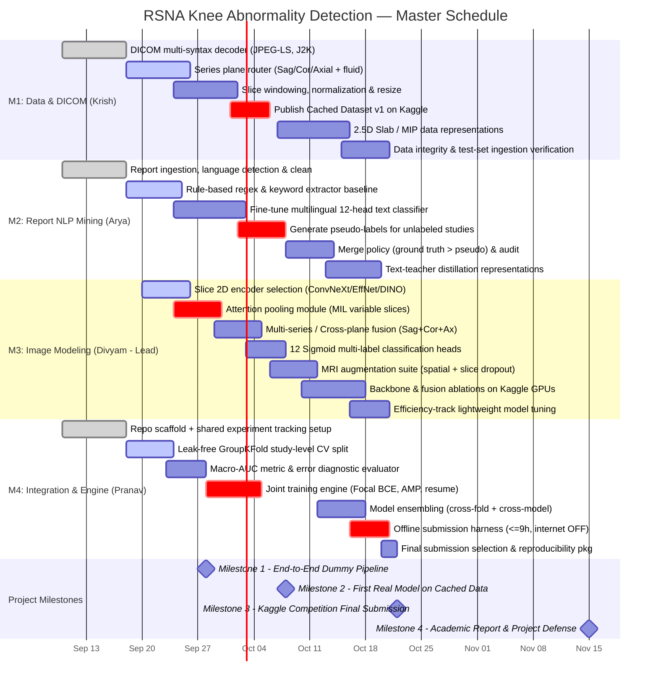

# RSNA Knee Abnormality Detection — Project Gantt Chart & Work Plan

**Course:** Data Science for Healthcare (Sem 5)  
**Project:** AI-Assisted Detection of Twelve Clinically Important Abnormalities on Knee MRI  
**Target Metric:** Macro-averaged AUC-ROC across 12 findings  
**Constraints:** 570 GB DICOM, Multilingual reports at train time only, Image-only at test time, Kaggle offline inference $\le$ 9 hours.

---

## 1. Visual Gantt Chart (Mermaid)



---

## 2. Detailed Member Workstreams & Deliverables

### Member 1: Krish Taparia (2024A7PS0580G) — Data & DICOM Pipeline
| Phase | Dates | Key Tasks | Concrete Deliverable |
|---|---|---|---|
| **Phase 1: Ingestion** | Sept 10 – Sept 22 | Multi-syntax DICOM reader (Explicit/Implicit VR, JPEG-LS, JPEG 2000), metadata extractor | Python DICOM decoding module tested on 500 studies with zero crashes |
| **Phase 2: Preprocessing** | Sept 22 – Oct 02 | Slice windowing (soft tissue / bone), aspect ratio resize (e.g. 256x256 or 384x384), sequence routing (Sagittal, Coronal, Axial, fluid-sensitive tags) | `preprocess.py` and metadata mapping CSV linking studies to series files |
| **Phase 3: Dataset Caching** | Oct 01 – Oct 06 | Package compressed tensors (`.npy` / `.h5` / resized WebP/PNG) and publish as private Kaggle Dataset | Kaggle Dataset v1 accessible to all team members |
| **Phase 4: Advanced Variants** | Oct 07 – Oct 16 | 2.5D slab generation (triplet slices) and Maximum Intensity Projections (MIP) for bone/ligament contrast | Kaggle Dataset v2 (slab variants for ablation) |

---

### Member 2: Arya Chauhan (2024A7PS1441G) — Report Label Mining (NLP)
| Phase | Dates | Key Tasks | Concrete Deliverable |
|---|---|---|---|
| **Phase 1: Normalization** | Sept 10 – Sept 20 | Text extraction from multilingual clinical reports; language identification; English translation/normalization | Clean text corpus dataframe indexed by `study_id` |
| **Phase 2: Rule Baseline** | Sept 18 – Sept 26 | Regex/negation rule extractor (handling medical negation like "no evidence of tear", "normal meniscus") | Rule-mined baseline label matrix for all 12 findings |
| **Phase 3: Multilingual Model** | Sept 24 – Oct 04 | Fine-tune 12-head transformer (e.g. Bio_ClinicalBERT or XLM-RoBERTa) on gold-labeled training subset | Trained text classifier outperforming rule baseline on validation split |
| **Phase 4: Pseudo-Labeling** | Oct 02 – Oct 12 | Infer labels for 100% of unlabeled studies with confidence filtering; audit distribution across findings | Full supervision file `train_labels_v1.csv` covering all studies |

---

### Member 3: Divyam Agarwal (2024A7PS1442G) — Image Modeling & Architecture (Group Leader)
| Phase | Dates | Key Tasks | Concrete Deliverable |
|---|---|---|---|
| **Phase 1: Backbone Selection** | Sept 20 – Sept 26 | Implement modular 2D feature extractor (ConvNeXt-Tiny, EfficientNet-B0/B2, DINOv2 feature extractor) | `models/backbones.py` producing $D$-dim feature vectors per slice |
| **Phase 2: Attention Pooling** | Sept 24 – Sept 30 | Gated slice attention module (MIL) handling variable $K \in [20, 300]$ slices into a fixed series embedding | `models/pooling.py` with unit tests on variable slice lengths |
| **Phase 3: Multi-Plane Fusion**| Sept 29 – Oct 05 | Cross-plane fusion module (Sagittal + Coronal + Axial embeddings) + 12 independent Sigmoid classification heads | `models/knee_model.py` outputting `(B, 12)` probabilities |
| **Phase 4: Augmentation Suite**| Oct 06 – Oct 12 | 3D-consistent slice spatial transforms (rotations, affine), intensity jitter, random slice dropout | `augmentations.py` integrated into dataset loader |
| **Phase 5: Ablations & Tuning** | Oct 10 – Oct 18 | Systematic ablations on Kaggle GPUs: Backbone comparisons, pooling comparisons, fusion mechanisms | Experiment leaderboard & ablation table for final paper/report |
| **Phase 6: Efficiency Model**   | Oct 16 – Oct 21 | Lightweight pruned/quantized model candidate for Kaggle Efficiency Prize submission | Model candidate running $< 0.15\text{s}$ per study |

---

### Member 4: Pranav Shreekrishna Lorekar (2024A7PS0567G) — Integration, Engine & Submission
| Phase | Dates | Key Tasks | Concrete Deliverable |
|---|---|---|---|
| **Phase 1: Infrastructure**   | Sept 10 – Sept 20 | Git repo structure, thin Kaggle notebook scaffold, experiment tracking (W&B / Kaggle metrics) | Working GitHub repo with automated Kaggle clone script |
| **Phase 2: Validation Strategy**| Sept 18 – Sept 25 | Study-level GroupKFold split (zero patient leakage) + official macro-AUC evaluation module | `validation.py` computing official competition metric |
| **Phase 3: Training Engine**   | Sept 28 – Oct 06 | Co-own training loop with M3: Multi-label Focal BCE Loss, mixed precision (AMP), checkpoint & resume | `train.py` capable of recovering from killed Kaggle sessions |
| **Phase 4: Ensembling & TTA**   | Oct 12 – Oct 18 | Out-of-fold blending, test-time augmentation (TTA), probability calibration / post-processing | Ensemble pipeline boosting macro-AUC over single models |
| **Phase 5: Offline Submission** | Oct 16 – Oct 21 | Build offline Kaggle submission notebook ($\le$ 9h runtime, internet disabled, bundled wheels) | Verified successful `submission.csv` on Kaggle leaderboard |
| **Phase 6: Reproducibility**    | Oct 21 – Nov 15 | Code cleanup, documentation, reproducibility artifact bundle, final academic project presentation | Final GitHub release & project presentation deck |

---

## 3. Critical Handoffs & Dependencies

```
[Krish: M1] Raw DICOM ──► Preprocessed Cache (Oct 1) ────────┐
                                                              ▼
[Arya: M2]  Reports    ──► Pseudo-Labels (Oct 4) ────────► [Divyam: M3 & Pranav: M4]
                                                              Training Engine & Model (Oct 5)
                                                                      │
                                                                      ▼
                                                              Cross-Validation & Ablations (Oct 12)
                                                                      │
                                                                      ▼
                                                              [Pranav: M4] Offline Submission <= 9h (Oct 18)
```

1. **Oct 01 Handoff (M1 $\rightarrow$ M3 & M4)**: Krish provides cached preprocessed slices so Divyam & Pranav can train on clean tensors without touching slow raw DICOMs.
2. **Oct 04 Handoff (M2 $\rightarrow$ M3 & M4)**: Arya delivers `train_labels_v1.csv` with mined labels across all studies to train the vision model.
3. **Oct 16 Handoff (M3 $\rightarrow$ M4)**: Divyam delivers final trained model weights for Sagittal/Coronal/Axial backbones to Pranav for ensembling and offline notebook packaging.
